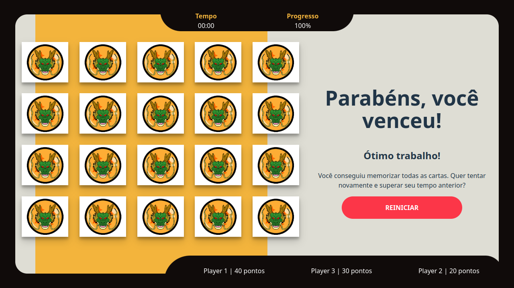

<div align="center">
    
</div>

# :video_game: Jogo da memória

Desafie sua memória e divirta-se com o Jogo da Memória! O objetivo é simples: encontre e combine os pares de cartas no menor tempo possível, usando o menor número de tentativas. Teste sua capacidade de concentração enquanto melhora seu desempenho a cada jogada.

## :globe_with_meridians: __Demo Online__:

Explore e teste a versão online, disponível em qualquer dispositivo com navegador.

* :arrow_right:  [Clique aqui para jogar agora!](https://db-memorygame.netlify.app/)

## :electric_plug: Instalação

__Dependências__:

* Node v18.18.0

Como instalar **Node.js**:

__1.__ Via **NVM** - Node Version Manager, consulte o [repositório](https://github.com/nvm-sh/nvm)   
__2.__ Via instalador (executável), consulte a [documentação](https://nodejs.org/en/download)


### :rocket: Como rodar o projeto

__1. Clone o repositório__

```
git clone git@github.com:chen-zhenn/memory-game.git
```

> **Nota**: 
Certifique-se de estar no diretório raiz do projeto **:open_file_folder: /**

__2. Habilite o arquivo de configuração para variáveis de ambiente__

```
cp .env.sample .env
```

> __Nota__:
Caso seu Shell não entenda o comando `cp`, faça a cópia manualmente.

__3. Instale as dependências__

```
npm i
```

__4. Levante a fake api__

```
npm run api
```

__5. Levante aplicação Front-end__

```
npm run dev
```

__6. Acesse seu navegador em__: [http://localhost:5173](http://localhost:5173)

### :boom: Boom!

> __Nota__:
Caso, por algum motivo a porta **5173** esteja sendo usada, verifique a porta setada para aplicação.


## :wrench: Tecnologias

* __Vite__: Ferramenta de Build
* __JavaScript__: Linguagem
* __Vue__: Framework Front-end
* __Sass__: Pre-processador CSS

## :open_book: Como usar

...